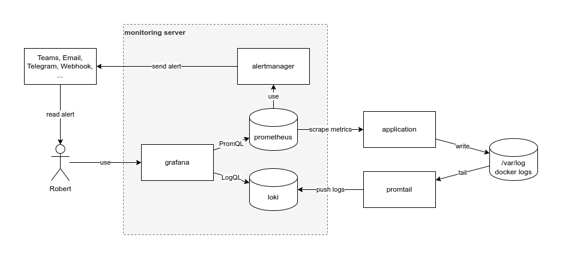

# Prometheus Grafana Stack


By default this runs at the domain `moni.0-main.de` [^0-main.de] exposing ...

- [Grafana Dashboard](https://grafana.moni.0-main.de/dashboards)
- [Prometheus UI](https://prometheus.moni.0-main.de/targets)
- [node exporter metrics](https://node.moni.0-main.de/metrics)
- [cadvisor metrics](https://cadvisor.moni.0-main.de/metrics)
- [blackbox HTTP ping
  metrics](https://blackbox.moni.0-main.de/probe?module=http_any&target=https://hukudo.de)
- [loki](https://loki.moni.0-main.de/ready)

[^0-main.de]: Our domain `0-main.de` points to localhost (see
              https://blog.hukudo.de/infra/0-main.html for more information)

Please note that all of these are also exposed via plain HTTP without TLS to
make scraping easier, because you get to see the same endpoints as prometheus
does. However you should disable this in security-sensitive contexts.

## Putting Docker Logs into Loki
We bind [Loki][] to `127.0.0.1:3100`. Please refer to
https://github.com/felixhummel/deploy-promtail on usage. Note that in a
production setup your Loki instance would run on another machine.

[Loki]: https://grafana.com/docs/loki/latest/

## Usage
To use it as is, make sure that you have our [ingress][] installed and running 
at version [2022-05.2](https://gitlab.com/hukudo/ingress/-/tags/2022-05.2) or
greater.
```
cat <<'EOF' > .env
GF_SECURITY_ADMIN_PASSWORD=changeme
EOF

docker-compose up -d --build --remove-orphans
dig moni.0-main.de +short
```

[ingress]: https://gitlab.com/hukudo/ingress


# Using another Domain
Replace `moni.0-main.de` with your TLD, e.g.:
```
rg -l 'moni\.0-main.de' | rg -v README.md \
  | xargs -L1 sed -i -e 's/moni\.0-main.de/example.com/'
```

We deliberately kept the many duplicates of fully qualified domain names to
keep readability high and aid debugging (think copy&paste).


# Development
```
vi prometheus/prometheus.yml
docker-compose kill -s SIGHUP prometheus

vi grafana/provisioning/
docker-compose restart grafana
```
